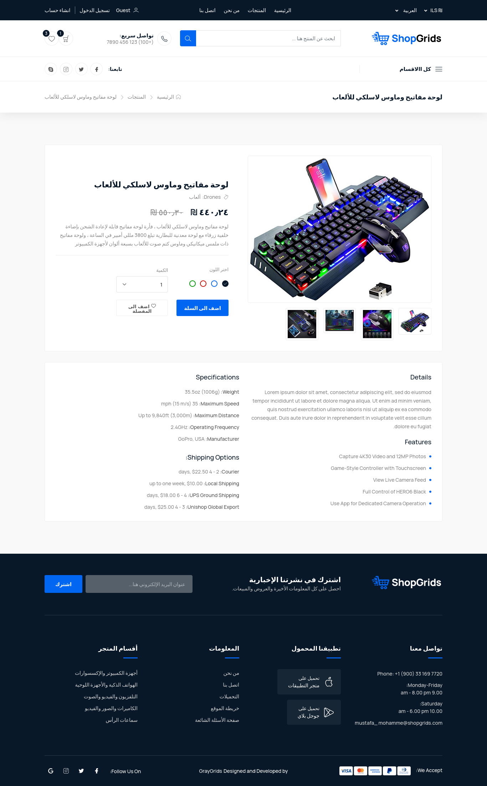

<a href="https://github.com/MustafaMohammed99/multi-vendor-store"> <h1 align="center">Multi-Vendor-Store </h1></a>

## Uses
* Storage files on googel drive 
By using Google Drive to store your files, you can reduce the amount of time it takes to load files on your website, as the files are being               served from Google's servers instead of your own.
* Upload files by  package filepond
By using filepond to upload files, you can improve the user experience by allowing users to upload files seamlessly without requiring a                   page refresh(upload asynchronous).
* support multi language by package mcamara
* Payment by package stripe .


#
## Table of Contents

* [Screenshots](#screenshots)
* [Requirements](#requirements)
* [Dependencies](#dependencies)
* [Installation](#installation)

<a name="screenshots"></a>
## 📸 Screenshots

||||
|:----------------------------------------:|:-----------------------------------------:|:-----------------------------------------: |
|  |  |  |
|  |  |  |


<a name="requirements"></a>
## Requirements

Package | Version
--- | ---
[Composer](https://getcomposer.org/) | V2.1.12+
[Php](https://www.php.net/)          | V8.0.2+
[Node](https://nodejs.org/en/)       | v18.12.0+
[Npm](https://nodejs.org/en/)        | V9.1.2+ 

<a name="dependencies"></a>
## dependencies

Package | Version
---- | ----
[masbug/flysystem-google-drive-ext](https://github.com/masbug/flysystem-google-drive-ext) | ^2.2
[mcamara/laravel-localization](https://github.com/mcamara/laravel-localization) | ^1.8
[stripe/stripe-php](https://github.com/stripe/stripe-php) | ^10.10
[laravel/fortify](https://github.com/laravel/fortify) | ^1.13
[pusher/pusher-php-server](https://github.com/pusher/pusher-http-php) | ^7.0


<a name="installation"></a>
## Installation

> **Warning**
> Make sure to follow the requirements first.

Here is how you can run the project locally:
1. Clone this repo
```sh
git clone https://github.com/MustafaMohammed99/multi-vendor-store.git
```

1. Go into the project root directory
```sh
cd multi-vendor-store
```

1. Copy .env.example file to .env file
```sh
cp .env.example .env
```
1. Create database `tds_store` (you can change database name)

1. Go to `.env` file 
- set database credentials 
```sh 
DB_DATABASE=multi_store
DB_USERNAME=root
DB_PASSWORD=[YOUR PASSWORD]
```
> Make sure to follow your database username and password

1. Go to `.env` file 
- set google drive credentials 
```sh 
GOOGLE_DRIVE_CLIENT_ID =
GOOGLE_DRIVE_CLIENT_SECRET =
GOOGLE_DRIVE_REFRESH_TOKEN =
```
>  Getting Google Keys 
- [Getting your Client ID and Secret](https://github.com/ivanvermeyen/laravel-google-drive-demo/blob/master/README/1-getting-your-dlient-id-and-            secret.md)
- [Getting your Refresh Token](https://github.com/ivanvermeyen/laravel-google-drive-demo/blob/master/README/2-getting-your-refresh-token.md)


1. Install PHP dependencies 
```sh
composer update
```

1. Generate key 
```sh
php artisan key:generate
```

1. install front-end dependencies
```sh
npm install && npm run dev
```

1. Run migration
```
php artisan migrate
```

1. Run seeder

> **Recommended**
>  mail configuration in .env file before seeding.

```
php artisan db:seed
```
this command will create users (admin and normal user):
> this link to login admin system http://localhost:8000/admin/login email: admin@gmail.com , password: password


1. Run server 

```sh
php artisan serve
```  

1. Visit [localhost:8000](http://localhost:8000) in your favoriite browser.

> Make sure to follow your Laravel local Development Environment.

1. notifications feature configuration (optional)
- Go to [pusher](https://pusher.com)
- Register your account, get API key and paste it into `.env` file.
